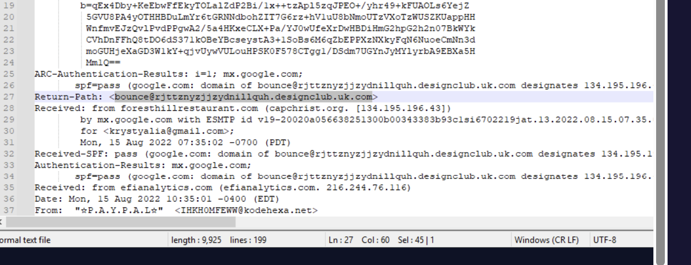
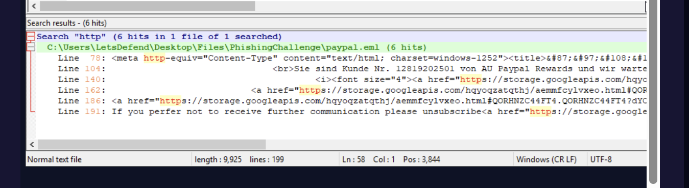
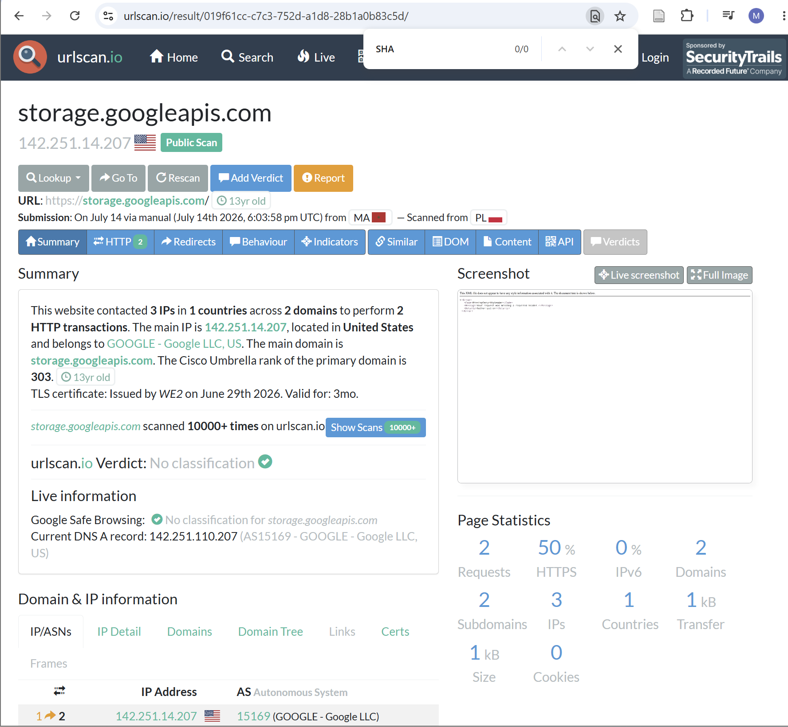

# Phishing Email

**Catégorie :** Phishing
**Difficulté :** Easy
**Statut :** ✅ 100% complété

## Contexte
Votre adresse email a fuité, et vous recevez un faux email PayPal (en allemand) — un cas classique de phishing. L'objectif est d'analyser le fichier `.eml` fourni comme le ferait un analyste SOC pour déterminer s'il est malveillant et en extraire les indicateurs de compromission (IOCs).

## Démarche d'investigation

**1. Analyse des en-têtes email (Return-Path)**
Ouverture du `.eml` dans un éditeur de texte pour lire les en-têtes bruts (pas le rendu visuel). Le `Return-Path` indique l'adresse réelle où rebondissent les erreurs d'envoi — souvent différente du `From:` affiché, ce qui trahit une usurpation. Ici : expéditeur affiché `☆P.A.Y.P.A.L☆` mais domaine d'envoi réel `designclub.uk.com` — aucun rapport avec PayPal.

**2. Extraction de l'URL malveillante**
Dans le corps HTML de l'email, recherche des balises `href=` pour trouver le lien sur lequel la victime est censée cliquer. Trouvé : un lien hébergé sur `storage.googleapis.com` (Google Cloud Storage) — une technique fréquente des attaquants : abuser d'un service cloud légitime pour héberger la fausse page, ce qui aide à contourner les filtres de réputation de domaine.

**3. Vérification via OSINT (urlscan.io / VirusTotal)**
Plutôt que d'ouvrir le lien directement (risqué), utilisation d'outils d'analyse tierce qui font la requête à notre place et en toute sécurité :
- **urlscan.io** : simule une visite du site dans un navigateur sandboxé, montre les requêtes réseau, redirections, et le hash SHA-256 de chaque ressource téléchargée (le "Resource Hash" trouvé).
- **VirusTotal** : agrège les verdicts de dizaines de moteurs antivirus/anti-phishing sur une URL ou un fichier.

**4. Calcul du hash du body**
Le SHA-256 du corps de la réponse HTTP sert d'IOC unique et fiable — même si l'URL change, le hash permet d'identifier ce contenu spécifique dans d'autres outils (threat intel, EDR, etc.).

## IOCs identifiés
- Expéditeur usurpé : `☆P.A.Y.P.A.L☆`
- Domaine d'envoi réel : `designclub.uk.com`
- URL malveillante : hébergée sur `storage.googleapis.com`
- Hash SHA-256 du body de la ressource (Resource Hash via urlscan.io)

## Conclusion / Verdict
Tous les signaux convergent : expéditeur usurpé, domaine d'envoi non lié à PayPal, lien vers une page hébergée abusivement sur un service cloud → **c'est bien un email de phishing.**

## Compétences travaillées
- Lecture d'en-têtes SMTP (Return-Path, Received, SPF/DKIM/ARC)
- Extraction d'IOCs (URLs, domaines) depuis un fichier `.eml`
- Usage d'outils OSINT sandboxés (urlscan.io, VirusTotal) pour analyser une menace sans s'exposer
- Identification de techniques d'évasion (abus de domaines cloud légitimes)

C'est un exercice représentatif du travail quotidien d'un analyste SOC de niveau 1 face à un signalement de phishing par un utilisateur.
