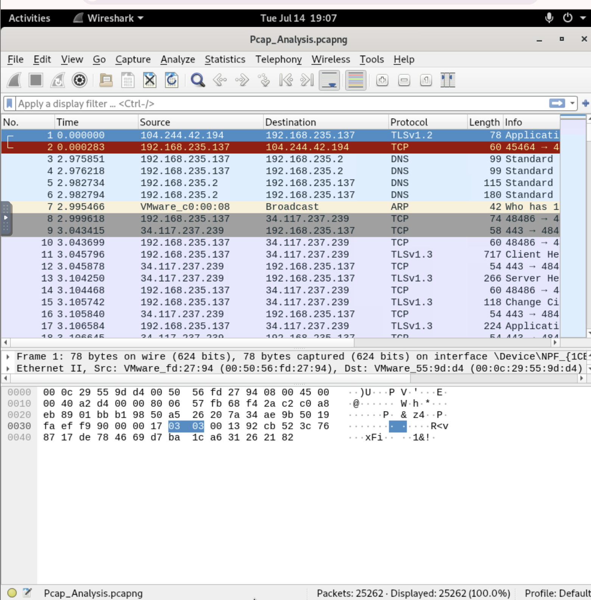
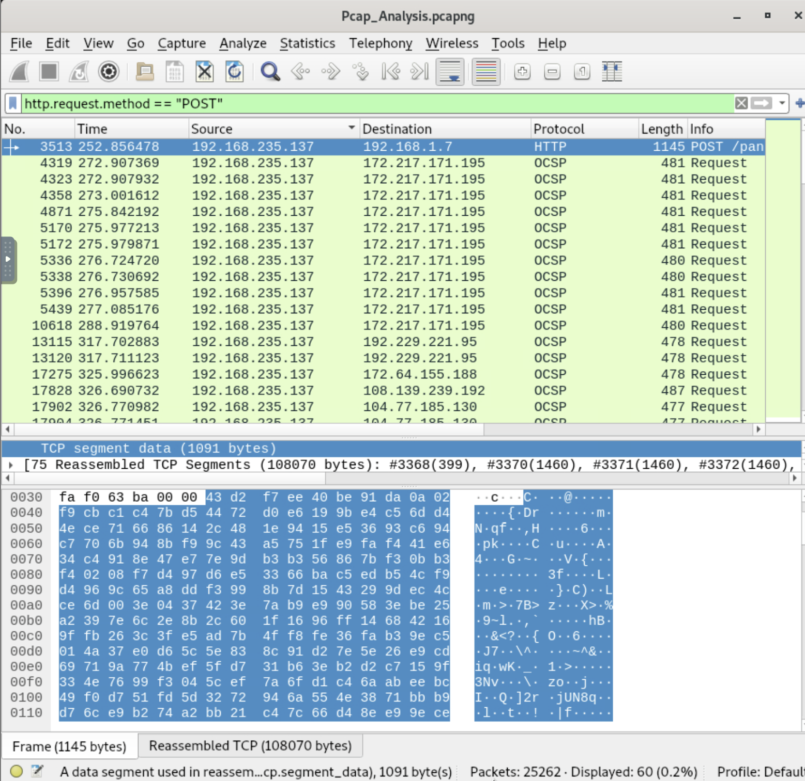
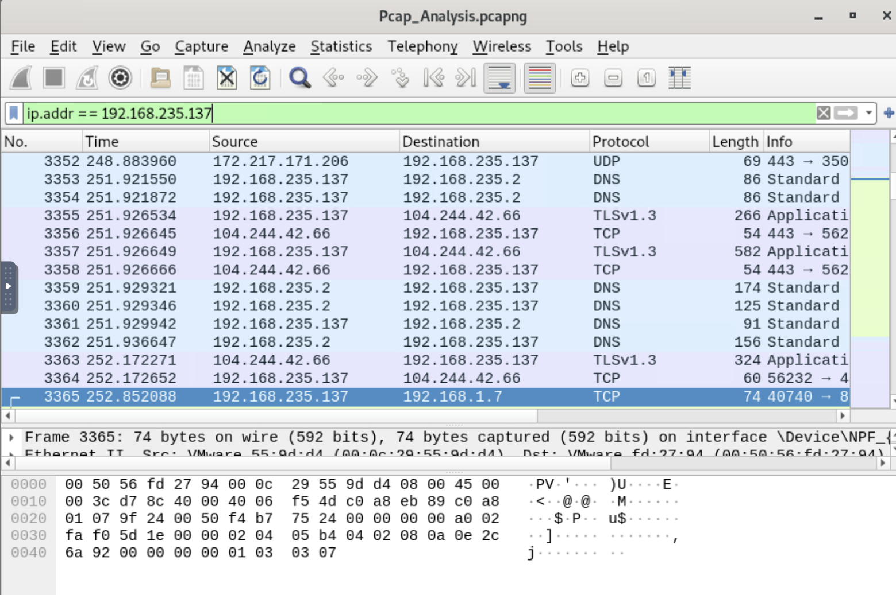
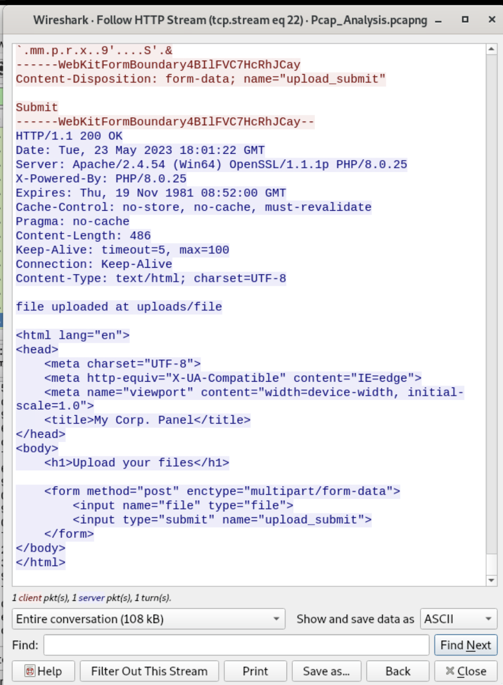
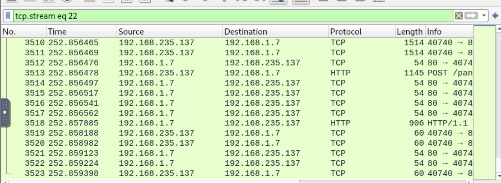

# 🌐 PCAP Analysis

**Catégorie :** Network Forensics · **Difficulté :** Easy · **Statut :** Complété

## Contexte
LetsDefend fournit une capture réseau (`Pcap_Analysis.pcapng`) prise sur l'ordinateur de "P13". L'objectif est de comprendre ce qui s'est passé sur le réseau — ici, un transfert de fichier suspect vers un serveur web interne.

## Méthodologie appliquée (avec Wireshark)

### 1. Vue d'ensemble du trafic
En ouvrant le pcap, on voit **25 262 paquets**, majoritairement du TLS chiffré (HTTPS normal, navigation web, mises à jour système, vérifications de certificats OCSP...). Ce bruit ne sert à rien pour l'investigation — il faut le filtrer.



### 2. Filtrage HTTP en clair
```
http
```
Ce filtre garde uniquement le trafic HTTP non chiffré. Dans un environnement moderne, très peu de choses passent encore en clair — donc ce qui reste est souvent significatif (ici du trafic système bruyant type `connectivity-check.ubuntu.com`, à ignorer).

### 3. Isoler les requêtes POST
```
http.request.method == "POST"
```
La méthode POST sert typiquement à envoyer des données vers un serveur (formulaires, uploads). Un seul résultat pertinent est apparu : `192.168.235.137 → 192.168.1.7`, `POST /panel.php`.



### 4. Follow HTTP Stream
En suivant le flux TCP complet (`tcp.stream eq 22`), on obtient la conversation HTTP entière en clair :

- **Requête** : upload d'un fichier binaire (`Content-Disposition: filename="file"`) vers un formulaire nommé `panel.php`, avec des données illisibles en ASCII (donc chiffrées/compressées).
- **Réponse** : `HTTP/1.1 200 OK`, avec le header `Server: Apache/2.4.54...` et surtout la ligne `file uploaded at uploads/file` — qui donne directement le répertoire de destination.




C'est cette technique (**Follow HTTP Stream**) qui est la plus puissante : Wireshark réassemble automatiquement tous les paquets TCP fragmentés en un seul flux lisible, requête et réponse confondues.

### 5. Identifier la communication réseau principale
Via **Statistics → Conversations** (onglet IPv4), on liste toutes les paires d'IP et leur volume d'échange. La plus grosse en octets (`156.200.32.172`) était juste du trafic web normal (streaming, CDN...). Il a fallu chercher spécifiquement la conversation locale suspecte entre les deux machines du même sous-réseau (`.137` et `.131`) avec :
```
ip.addr == 192.168.235.131
```
Ce filtre a révélé une connexion TCP soutenue sur un port inhabituel (250→595x) — pas du trafic web classique, donc potentiellement une connexion applicative dédiée (C2, backdoor, ou service métier custom).



### 6. Calculer la durée d'un transfert
En comparant le timestamp du premier paquet et celui du dernier paquet du même flux TCP (`tcp.stream eq 22`), on obtient la durée exacte de l'échange : `dernier − premier = 0.0073 s`. Un transfert de ~105 Ko en 7 millisecondes = réseau local très rapide (LAN), cohérent avec une communication interne.

## 🎓 Ce que ça enseigne

- Ne jamais chercher directement l'aiguille dans la botte de foin : on filtre progressivement (tout → HTTP → POST → un flux précis) plutôt que de scroller 25 000 paquets.
- **Follow Stream** est l'outil le plus rentable pour lire une conversation applicative complète sans se perdre dans les paquets individuels.
- **Statistics → Conversations** donne une vue macro pour repérer les échanges anormaux (volume, ports, IPs internes vs externes) avant de creuser au niveau paquet.
- Un fichier uploadé illisible en ASCII + un endpoint nommé `panel.php` + un répertoire `uploads/` sont des signaux classiques d'un webshell ou d'un panel de contrôle utilisé pour exfiltrer ou déposer des fichiers — typique d'une compromission.

## ✅ Verdict
C'est un exercice représentatif de l'analyse forensique réseau (Network Forensics) qu'un analyste SOC de niveau 2 effectue lors d'un incident de type exfiltration de données ou compromission de poste.
